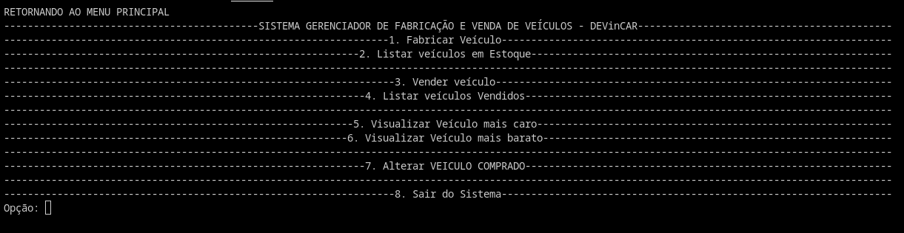
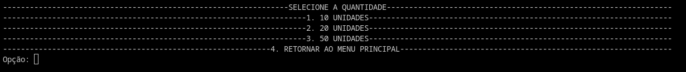
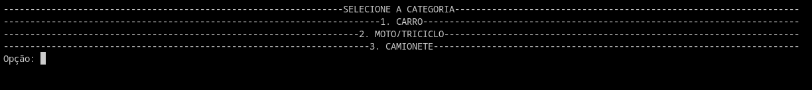
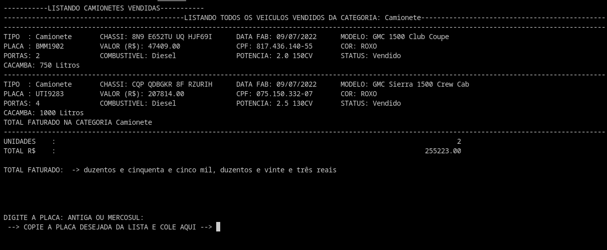

<h1>Projeto 01 - MÓDULO 02 - Senai DEVinHouse[ConectaNuvem]</h1>

<h2>Nome do Projeto: DEVinCAR Project</h2>

Neste primeiro projeto do segundo módulo devemos construir um sistema que simula uma MONTADORA e REVENDA de Carros. Neste sistema deverá conter 3 tipos de carros:

<ul>
    <li>Carros</li>
    <li>Moto/Triciclo</li>
    <li>Camionete</li>
</ul>

Cada um deles deverá possuir características em comum, porém cada um deles vão possuir as suas características particulares.

<strong>Professor: </strong>Yan Esteves

<strong>Curso: </strong>Senai DEVinHouse[ConectaNuvem] - MÓDULO 02

<h3>Linguagens, conceitos e tecnologias utilizadas neste projeto:</h3>

<ul>
    <li>Python 3.10</li>
    <li>Programação Orientada a Objetos</li>
    <li>
        <li>Conceitos de Classes Abstratas</li>
        <li>Herança e Polimorfismo</li>
        <li>Métodos estáticos</li>
    </li>
    <li>Persistência de Dados com JSON</li>
    <li>
        <li>Biblioteca TinyDB - Manipulação de JSON</li>
    </li>
    <li>Bibliotecas Gerais</li>
    <li>
        <li>Biblioteca Faker_vehicle - Gerando nomes de automóveis de forma aleatória</li>
        <li>Biblioteca num2words - Escrevendo valores monetários por extenso</li>
        <li>Biblioteca termcolor - Escrevendo colorido no terminal</li>
        <li>Entre outras bibliotecas bultins do Python: os, random, datetime, etc...</li>
    </li>
    <li>Versionamento com GIT</li>
</ul>

<h3>Descrição de como ficou o projeto e seu fluxo de trabalho</h3>

Ele é iniciado pelo main.py que gera um menu com 8 opções: Para executar, é necessário entrar no ambiente virtual e instalar as bibliotecas contidas em requirements.txt

<strong>$ source ./venv/bin/activate</strong>

<strong>$ pip install -r requirements.txt</strong>

<strong>$ python main.py</strong>

 

<h4>1. Fabricar Veículo</h4>
    
<li>SELECIONE A QUANTIDADE</li>

<h5>1.1 10 unidades</h5>
<ul>
    <li>SELECIONE A CATEGORIA</li>
    <li>1.1.1 Carro</li>
    <li>1.1.2 Moto/Triciclo</li>
    <li>1.1.3 Camionete</li>
</ul>

<h5>1.2 20 unidades</h5>
<ul>
    <li>SELECIONE A CATEGORIA</li>
    <li>1.2.1 Carro</li>
    <li>1.2.2 Moto/Triciclo</li>
    <li>1.2.3 Camionete</li>
</ul>

<h5>1.3 50 unidades</h5>
<ul>
    <li>SELECIONE A CATEGORIA</li>
    <li>1.3.1 Carro</li>
    <li>1.3.2 Moto/Triciclo</li>
    <li>1.3.3 Camionete</li>
</ul>      
<h5>1.4 Retornar ao menu principal</h5>

<h4>2. Listar Veículos em estoque</h4>
<ul>
    <li>ESCOLHA A CATEGORIA PARA LISTAR O ESTOQUE</li>
    <li>2.1 Carro</li>
    <li>2.2 Moto/Triciclo</li>
    <li>2.3 Camionete</li>
    <li>2.4 Retornar ao menu principal</li>
</ul>

<h4>3. Vender veículo</h4>
<ul>
    <li>ESCOLHA A CATEGORIA</li>
    <li>3.1 Carro</li>
    <li>3.2 Moto/Triciclo</li>
    <li>3.3 Camionete</li>
    <li>3.4 Retornar ao menu principal</li>
</ul>

<h4>4. Listar Veículos vendidos</h4>
<ul>
    <li>ESCOLHA A CATEGORIA PARA LISTAR VEÍCULOS VENDIDOS</li>
    <li>4.1 Carro</li>
    <li>4.2 Moto/Triciclo</li>
    <li>4.3 Camionete</li>
    <li>4.4 Retornar ao menu principal</li>
</ul>

<h4>5. Visualizar veículo mais caro</h4>
<ul>
    <li>5.1 Em Estoque</li>
    <li>5.2 Vendidos</li>
</ul>

<h4>6. Visualizar veículo mais barato</h4>
<ul>
    <li>6.1 Em Estoque</li>
    <li>6.2 Vendidos</li>
</ul>

<h4>7. Alterar Veículo Comprado</h4>
<ul>
    <li>SELECIONE A CATEGORIA</li>
    <li>7.1 Carro</li>
    <li>7.2 Moto/Triciclo</li>
    <li>7.3 Camionete</li>
    <li>7.4 Retornar ao menu principal</li>
</ul>
<h4>8. Sair do Sistema</h4>

<h3>FLUXO DO PROGRAMA</h3>

Para este programa, imaginei o seguinte: 

Ao executar o programa, se o usuário selecionar as opções de listar veículos em estoque ou vendidos, ou visualizar veiculo mais caro ou mais barato, ou mesmo alterar veículo comprado, ele não irá conseguir, pois não existem veículos cadastrados.

Logo, ao iniciar, a primeira coisa a se fazer será ir na opção 1 e fabricar os veículos desejados na quantidade desejada.

Ao iniciar a aplicação, haverá a instanciação de 3 objetos das 3 classes: Carro, MotoTriciclo e Camionete. Estarão na memória aguardando o acionamento de seus métodos.

Ao fabricar veículos, o método fabricar_veículo da instância escolhida será chamado para povoar o arquivo JSON com veículos cujos dados serão gerados de forma aleatória. chassi, cor, valor, etc .... Serão gerados, 10, 20 ou 50 de uma vez e inseridos no array... Todos com a data de sua fabricação e 0km, sem dono. Agora estão em estoque.

Para listar estes itens, basta ir na opção 2 e listá-los para saber quantos itens possuimos em estoque, bem como todos seus dados e valor total que é a soma de todos os itens do estoque.

Para Vender um veículo, é necessário que ele esteja no estoque, e basta copiar o chassi do item desejado, colar no input e teclar enter. Se o usuário tiver digitado o chassi corretamente ele prosseguirá pedindo outros dados para concretização da venda.

Ao vender um veículo, todos os dados inseridos possuem validação, sendo necessário inserir CPF válido e placa que esteja no formato antigo (sem o traço MMM0000) ou mercosul (XXX0X00).

Após a venda, o veículo sairá da lista de estoque e passará a ser visível somente na lista de veiculos vendidos, que podem ser acessados na opção 4 do menu principal.

Podemos visualizar veículos mais caros do estoque e dos que foram vendidos.

Podemos visualizar veículos mais baratos do estoque e dos que foram vendidos.

A alteração de veículos só é possível para aqueles que já foram vendidos, sendo que em uma das opções (Camionete), inseri uma brincadeira com relação à cor ROXA referida nos requisitos do sistema, onde apesar de não termos escolha, decidi fazer o usuário de bobo e tentar escolher uma nova cor, mas ele terá uma surpresa ao tentar fazer isso.

<h1>Telas do Sistema</h1>

<h2>MENU PRINCIPAL</h2>

<h2>SELECIONANDO QUANTIDADE DE ITENS A SEREM FABRICADOS</h2>

<h3>SELEÇÃO DE CATEGORIA</h3>

<h3>LISTAGEM DE ITENS VENDIDOS</h3>

Algumas considerações: 

Como eu não encontrei uma biblioteca mais específica que tivesse nomes de carros, motos e camionetes de forma separada, fui obrigado a utilizar a mesma que gera nomes de carros para preencher os nomes. Logo, teremos motos e camionetes com nomes de carros, ou vice versa.

Estou bem ciente que era pra ter escrito uma classe histórico, que tivesse seus métodos pra criarmos os relatórios do sistema, mas como o projeto foi se estendendo, pois levei muito tempo pra fazer as validações, então fiquei com o tempo curto para reverter um menu funcional para uma classe histórico... E como este menu estava cumprindo as funcionalidades pedidas nos requisitos, resolvi abortar a classe histórico pra que eu pudesse ao menos entregar funcionando.

Em projetos assim, há uma corrida contra o tempo e temos de tomar decisões desse tipo, pois chega nessas horas a cabeça não consegue mais ter foco e energia pra reverter códigos.

No mais, curti bastante escrever esse projeto, pois consegui colocar coisas legais e até divertidas nele.

<small>Maycon R. Campos - DEVinHouse - 09/07/2022</small>
